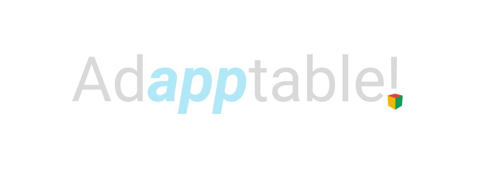

A simple web interface to select open-source components and plugins from the community, and fuse the selection into a single application installer, to easily setup company tools.

We aim to support the following open source applications and frameworks:
- IntelliJ Platform
- Blender
- GIMP Editor

You'll be able to choose branding schemes, included license, and much more about it! You'll also be able to select specialized functionality in your customized app to support tools like Python, meta-programming, and architecture!

# Usage
There are several recommended methods for installation of Adapptable:
- One way is to load this source folder into the default app folder in an Electron distribution, which is ```Electron.app/Contents/Resources/app/``` on Mac, and ```electron/resources/app``` on Windows and Linux.
- You could go to releases for the ```app.asar``` to put in replacement of the app folder.
- You could even get a sandboxed MAS build from the Mac App Store.
- You could get a self-extracting Windows build from the release archive.

# License

The application frontend is currently licensed under the copyleft GPLv3 for competitive advantage. The backend, however, is proprietary and potentially commercial as of this moment. Nothing in the `resources/` folder is licensed or our content.
